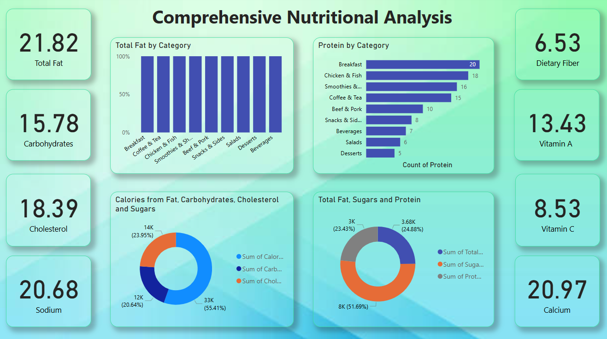

# 🥗 Nutrition Analysis Dashboard (Power BI)

## 📌 Project Overview

This Power BI dashboard analyzes nutritional information across different food categories.
It helps understand the distribution of nutrients such as fats, carbohydrates, protein, vitamins, and minerals.

The dashboard provides insights into calorie composition and nutrient distribution across various food types.

## 🎯 Objectives

* Analyze nutrient composition across food categories
* Compare protein distribution among different foods
* Study calorie contribution from fats, carbohydrates, and cholesterol
* Understand vitamin and mineral distribution

## 📊 Key Metrics

* Total Fat: 21.82
* Carbohydrates: 15.78
* Cholesterol: 18.39
* Sodium: 20.68
* Dietary Fiber: 6.53
* Vitamin A: 13.43
* Vitamin C: 8.53
* Calcium: 20.97

## 📈 Key Insights

* Breakfast and chicken-based foods show higher protein values.
* Sugars contribute significantly to overall calorie composition.
* Some food categories have higher sodium and cholesterol levels.
* Nutritional distribution varies significantly across categories such as beverages, salads, desserts, and snacks.

## 📊 Visualizations Used

* KPI Cards
* Bar Charts
* Donut Charts
* Nutrient Distribution Analysis

## 🛠 Tools Used

* Power BI
* Data Visualization
* Data Analysis

## 📷 Dashboard Preview

## 📂 Dataset

Food nutrition dataset containing nutrient values including fats, carbohydrates, protein, vitamins, and minerals for different food categories.
